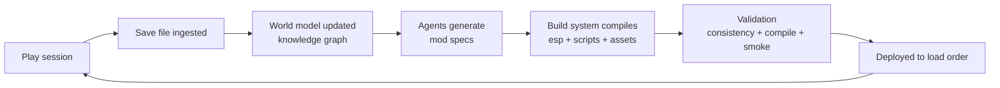

# The Forever Game — Creation

> A content pipeline whose input includes its own output's consequences.

**The Forever Game** is a long-horizon vision: by 2030, continuously and programmatically
produce new game content for mod-friendly games — content that responds to what the player
actually did. This repo is the **Creation Engine flavor**: Fallout 4 first, with Skyrim and
Starfield as sibling backends (the plugin toolchain speaks all three).

## The loop



The player plays. The system reads the save — quests finished, NPCs killed, factions joined,
places explored. The world model updates. Agents generate new content grounded in that
history. A deterministic build system compiles it into a real mod. Validation gates it.
The world moves while you sleep.

Bethesda's Radiant quest system is a hand-rolled 2011 version of this idea, trapped inside
the engine. Radiant is `template + slots + current world conditions`. This is
`historical world state + semantic relationships + authored constraints + agent planning +
deterministic compilation`. Same conceptual family, orders of magnitude more capable —
because continuity is represented explicitly in the graph, not hallucinated.

**The conceptual leap:** this is not fundamentally a mod generator. It is a **persistent
world-state system with a game engine attached**. The knowledge graph is the semantic
world; the ESPs are serialization; the save is telemetry. The product is not infinite
content — it is **consequences that compound**.

## The five layers

| # | Layer | What it is | Status |
|---|-------|-----------|--------|
| 0 | **Provenance ledger** | Append-only event log of every generation: inputs, decisions, artifacts, hashes, resulting saves. Enables causal archaeology and principled retcons | design |
| 1 | **World model** | Knowledge graph of the game: records, lore, factions, quests — and everything we've generated, so year-3 content can reference year-1 content | design |
| 2 | **Game-state access** | MCP server exposing plugin records + parsed save files as queryable tools for agents | design |
| 3 | **Generation** | Specialized agents (quest designer, dialogue writer, item balancer) that emit declarative **mod specs** — never raw bytes | design |
| 4 | **Build system** | Deterministic compiler: mod spec → Mutagen plugin + Papyrus + assets + BA2. No AI inside this layer | design |
| 5 | **Validation & feedback** | Consistency checks, compile gates, in-game smoke tests, and save-file telemetry closing the loop | design |

The **mod spec** (layer 3→4 boundary) is the load-bearing artifact of the whole system:
a clean declarative intermediate representation between AI intent and engine bytes.
Games change, models change — the IR survives. See [specs/modspec](specs/modspec/README.md).

## Docs

- [Architecture](docs/ARCHITECTURE.md) — the five layers in detail
- [Capability matrix](docs/CAPABILITY-MATRIX.md) — every mod type, sorted by automatability
- [Toolchain](docs/TOOLCHAIN.md) — the tools, what's headless, what isn't
- [Roadmap](docs/ROADMAP.md) — crawl / walk / run / fly, 2026 → 2030

## Repo layout

```
docs/           architecture, capability matrix, toolchain, roadmap
specs/modspec/  the declarative mod-spec format (drafts + examples)
src/            build system + libraries (.NET / Mutagen)
mcp/            the fo4 MCP server (game-state access layer)
agents/         generation agent definitions and prompts
ontology/       knowledge-graph schemas and ingestion scripts
```

## Prior art (in-house)

This is not a cold start. The pattern — binary save format → SQLite → MCP server →
agent analysis — has been built twice already for Paradox titles (EU5, HOI4), and the
knowledge-graph layer (kgrdbms) is running in production with an EU5 rules ontology.
The Forever Game points the same machinery at games that accept content back.
